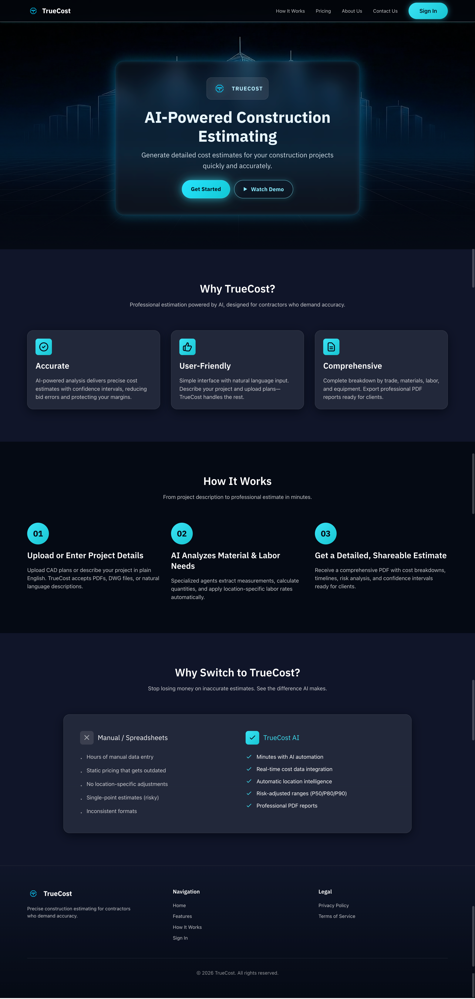
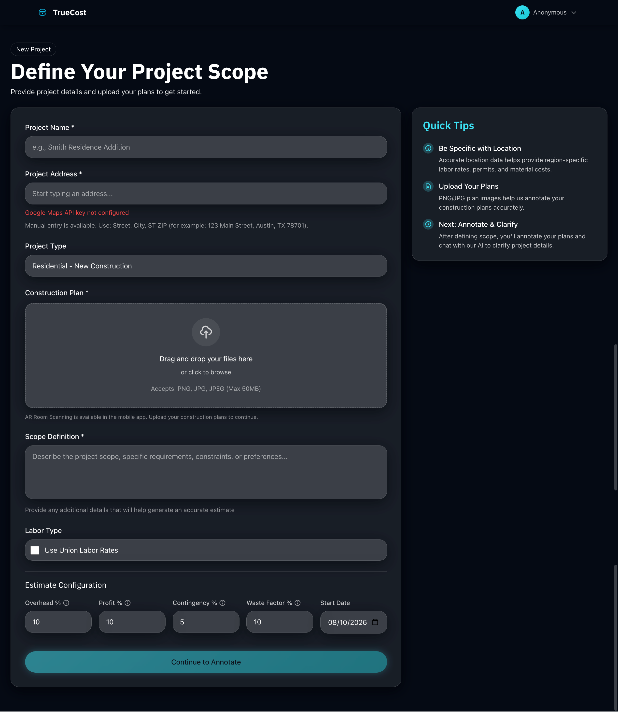

# 💰 TrueCost

### A practical project focused on understanding and calculating the true cost of a product, service, or transaction.

TrueCost is a project designed to explore how different cost components can be combined to provide a clearer picture of the **actual cost** rather than relying only on the initial or visible price.

---

## 📌 Project Overview

The idea behind **TrueCost** is to look beyond a basic price and consider the different factors that contribute to the final cost.

The project demonstrates practical software development concepts including:

* 📊 Data handling
* 🧮 Cost calculations
* 🧹 Data processing
* ⚙️ Application logic
* 📈 Presenting meaningful results

---

## ✨ Features

* 💰 Calculate overall/true cost
* 📊 Work with cost-related data
* 🧮 Perform calculations based on multiple inputs
* 🔍 Organize and process information
* 📈 Present calculated results clearly

---

## 🛠️ Technologies

> Update this section with the technologies actually used in the project.

* Python
* Pandas
* NumPy
* [Add other technologies used in the project]

---

## 📂 Project Structure

```text
truecost/
│
├── README.md
│
└── [Add your project files here]
```

---

## 🚀 Getting Started

### 1. Clone the repository

```bash
git clone https://github.com/maryamabdulkarim361-lab/truecost.git
```

### 2. Navigate to the project

```bash
cd truecost
```

### 3. Install dependencies

If the project contains a `requirements.txt` file:

```bash
pip install -r requirements.txt
```

### 4. Run the project

```bash
python [your_main_file].py
```

> Replace `[your_main_file].py` with the actual entry-point file.

---

## 🖼️ Screenshots

### Main Interface



### Input / Data



### Results


---

## 📚 What I Learned

Working on TrueCost helped me strengthen my understanding of:

* Python programming
* Working with structured data
* Data processing and calculations
* Building application logic
* Presenting results in a user-friendly way
* Organizing a project for GitHub

---

## 🔮 Future Improvements

Possible future improvements include:

* 📊 Interactive dashboards
* 📈 Data visualization
* 🤖 AI-assisted cost analysis
* 📁 Export results to CSV/PDF
* 🔐 User accounts and saved calculations
* ☁️ Deployment as a web application
* 📱 Mobile-friendly interface

---

## 👩‍💻 Author

### Maryam Abdul Karim

Computer Science Graduate | AI/ML Learner | Python Developer

I'm currently focusing on **Artificial Intelligence, Machine Learning, AI Agents, Python, Django and practical software solutions**.

### Connect With Me

[](https://www.linkedin.com/in/maryamabdulkarim361/)

[](https://www.upwork.com/freelancers/~013954875ad706a30d?mp_source=share)

[](https://github.com/maryamabdulkarim361-lab)

---

⭐ If you find this project interesting, feel free to explore the repository.
